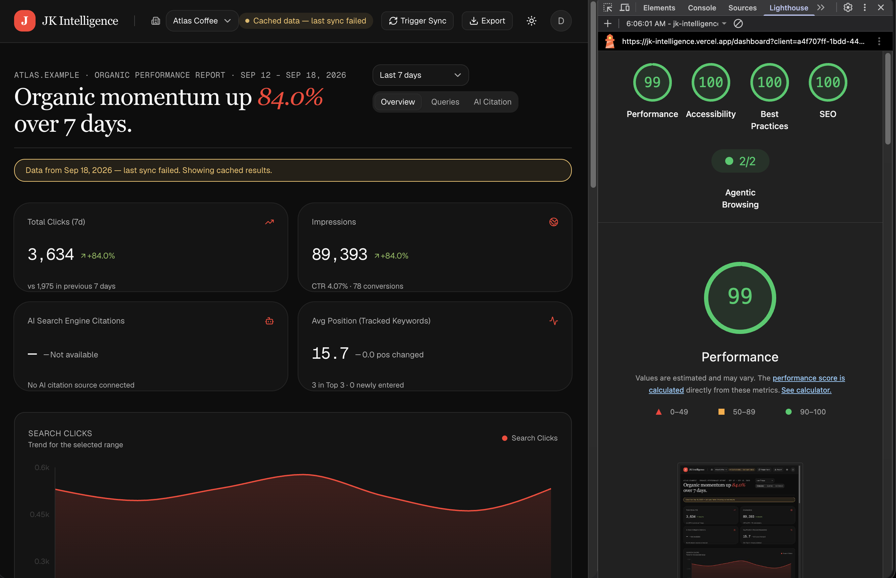

# JK Intelligence

Multi-client SEO reporting platform: Next.js 16, React 19, TypeScript, Supabase (Postgres + RLS + auth), shadcn/ui, BullMQ on Upstash.

- Scope and status: [context/project-overview.md](context/project-overview.md), [context/progress-tracker.md](context/progress-tracker.md)
- Built vs planned: [AGENTS.md](AGENTS.md) describes implemented code only; [docs/target-state.md](docs/target-state.md) holds the rest

## Dashboard



Deployed at `jk-intelligence.vercel.app`. Screenshot: dark theme, one client ("Atlas Coffee"), Last 7 days. Header carries the client switcher, sync pill, Trigger Sync, CSV/PDF export, theme toggle and account menu; below it the hero headline, `7 | 30 | 90` range select, metric cards, click-trend chart and query table.

Not live yet, do not demo them as working:

- **Sync.** No consumer runs the queue — `lib/queue/worker.ts` returns `mock_completed`, and Trigger Sync only animates its own state. All rows come from `pnpm db:seed`.
- **Stale banner / sync pill.** Reads the stored `is_stale` column; nothing writes it, so it cannot fire outside seed data.
- **AI citations.** `aiCitations` is a hardcoded `[]`, so the card and grid always render their empty state. No LLM dependency exists.

## Architecture


Request path, the RLS-backed tenant gate and the HTTP surface: [AGENTS.md](AGENTS.md). Deep boundaries: [context/architecture-context.md](context/architecture-context.md).

## Development

Node `>=24`, pnpm `>=10` (`package.json` engines). pnpm only — `package-lock.json` was deleted on purpose.

```bash
pnpm install
pnpm dev    # http://localhost:3000
```

Local auth needs two names in `.env`: `NEXT_PUBLIC_SUPABASE_URL` and `NEXT_PUBLIC_SUPABASE_PUBLISHABLE_KEY` (legacy `NEXT_PUBLIC_SUPABASE_ANON_KEY` still works). Server-side paths also want `SUPABASE_SERVICE_ROLE_KEY`, `SUPABASE_DB_URL`, `UPSTASH_REDIS_REST_URL`, `UPSTASH_REDIS_REST_TOKEN`, `CRON_SECRET`, `NEXT_PUBLIC_APP_URL`, and the private `DEMO_EMAIL`/`DEMO_PASSWORD`. Copy `.env.example` and fill it in — never copy values between machines. Register the Supabase providers and add `/auth/callback` to the redirect allowlist, then `pnpm db:migrate && pnpm db:seed` for demo data.

## Checks

```bash
pnpm test && pnpm typecheck && pnpm lint && pnpm build
```

`pnpm test` is the Vitest **unit** project only. Tests live in `tests/<feature>/<tier>/`, so the
full picture needs `pnpm test:all` (adds integration, which currently has no files and so collects
zero) and `pnpm test:e2e` / `pnpm test:e2e:auth` for the Playwright tiers — the public tier runs in
CI after the build, the authed tier is local-only because it needs real credentials.

CI (`.github/workflows/ci.yml`) runs the four above plus the public e2e tier on every push and PR.

## Feature workflow

Read [AGENTS.md](AGENTS.md) and its ordered `context/` files before implementing.

- Specs: `context/feature-specs/<nn>-<slug>.md`. Components: `components/features/<slug>/`, exported through `index.ts`. Numbers belong only to spec filenames.
- Tracker: mark **In Progress** before implementing, complete after verification.
- Branches `feat/<slug>`, titles `feat(<slug>): <summary>`. Commit, push and open PRs only when asked.
- Full rules: [docs/conventions/feature-components.md](docs/conventions/feature-components.md).

OpenCode only: `/feature-component <spec>` runs the [feature-component](.claude/skills/feature-component/SKILL.md) skill (command file `.opencode/commands/feature-component.md`, link `.agents/skills/feature-component`). No argument → it asks. Restart OpenCode after editing commands or skills.
