# JK Intelligence

Multi-client SEO reporting platform built with Next.js, TypeScript, Supabase, and shadcn/ui. Product scope and implementation status live in [context](context/project-overview.md) and the [progress tracker](context/progress-tracker.md).

## Architecture



## Development

Requires Node.js >=22.9 and pnpm >=10 (see `package.json`).

```bash
pnpm install
pnpm dev
```

Open http://localhost:3000. Auth requires local environment variables:

- `NEXT_PUBLIC_SUPABASE_URL`
- `NEXT_PUBLIC_SUPABASE_PUBLISHABLE_KEY` (legacy `NEXT_PUBLIC_SUPABASE_ANON_KEY` supported)

Configure Supabase providers and redirect URLs for the auth flows. Keep credentials out of Git. Live auth verification and outstanding setup are tracked in [progress tracker](context/progress-tracker.md).

## Checks

```bash
pnpm test && pnpm typecheck && pnpm lint && pnpm build
```

## Feature Workflow

Read [AGENTS.md](AGENTS.md) and its ordered context files before implementation.

- Specs: `context/feature-specs/<nn>-<slug>.md`.
- Components: `components/features/<slug>/`, public exports through `index.ts`.
- Numbers belong only to spec filenames; feature folders/imports stay unnumbered.
- Mark tracker **In Progress** before implementation; complete after verification.
- PR branches: `feat/<slug>`; titles: `feat(<slug>): <summary>`. Commit/push/PR only when requested.

Full rules: [feature conventions](docs/conventions/feature-components.md).

## Feature Command

In OpenCode, use the project slash command:

```text
/feature-component context/feature-specs/03-user-profile.md
/feature-component add a feature for saved reports
```

The command loads [feature-component](.claude/skills/feature-component/SKILL.md), follows the spec-first workflow, and wires pages through the feature barrel. With no arguments, it asks which feature to work on.

- Command: `.opencode/commands/feature-component.md`
- Skill: `.claude/skills/feature-component/SKILL.md`
- Shared discovery link: `.agents/skills/feature-component`

Quit and restart OpenCode after command/skill changes. `/help` shows OpenCode usage help.
